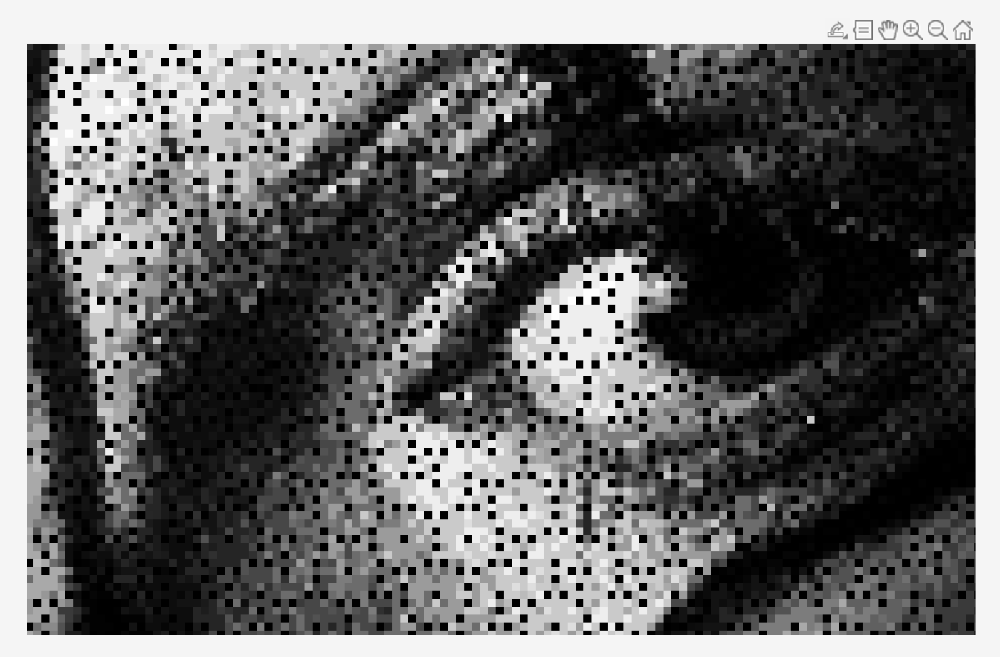

# Lab 1 - Introduction to Matlab

## Task 1 - Image Rotation
Forward mapping and inverse mapping at same angle (pi/6):

  

Holes in the forward mapping observable: 

  

* why does it create holes? explain
* explain forward mapping figure and eq
* explain inverse mapping figure and eq

## Task 2 - Image Shearing

  

* image shearing figure and eq