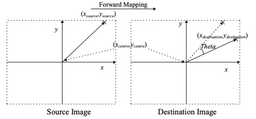
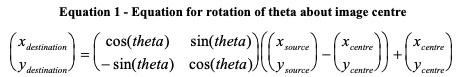
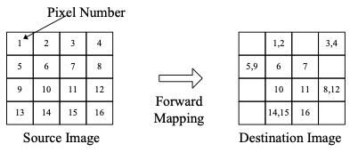
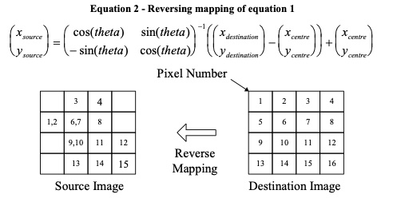
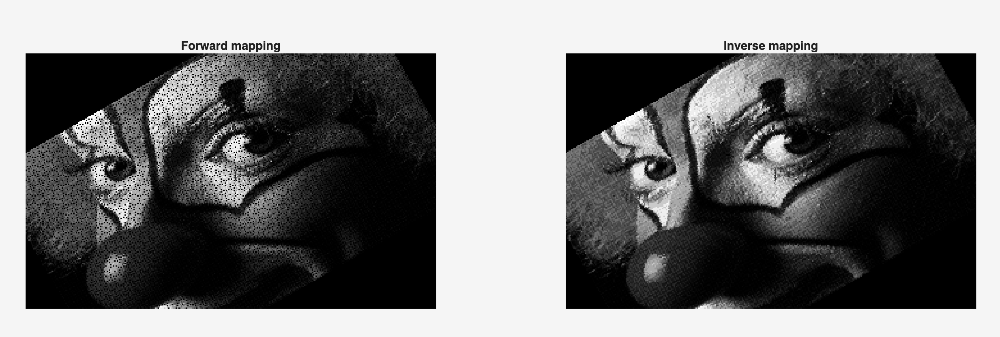
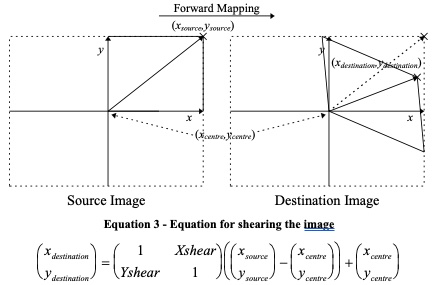
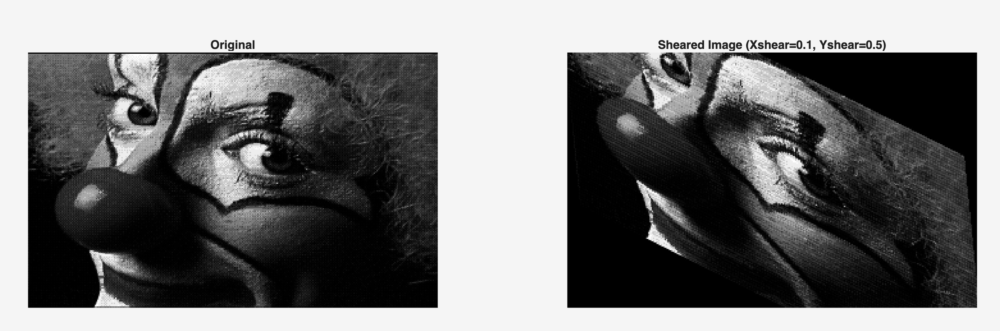

# Lab 1 - Introduction to Matlab

## Task 1 - Image Rotation
### Image Rotation Logics
<p align="center">  </p>
<p align="center">  </p>

<p align="center">  </p>

**Forward mapping** Works out the destination pixel location using the forward mapping equation.

<p align="center">  </p>

**Reverse mapping** works out where each destination pixel came from in the source image. This uses the inverse of the transformation matrix.

### Results
**Forward mapping and reverse mapping codes are written and tested at same angle:**

```matlab
R = [cos_t  sin_t;
    -sin_t  cos_t];
    
R_inv = inv(R)

Tc = [xc; yc];

% forward mapping (... in the loop)
V_src = [x_src; y_src];
V_dest = R * (V_src - Tc) + Tc;

% reverse mapping (... in the loop)
V_dest = [x_dest; y_dest];
V_src = R_inv * (V_dest - Tc) + Tc;
```

For the full code, refer to `forward_mapping.m` and `reverse_mapping.m` in the `/code` folder.

The transformation matrix `R` and the center of the image `Tc` is defined before the loop. 

Inside the loop, forward mapping sets the source pixel from the loop index and calculate destination pixel based on it, while reverse mapping works the opposite way around.

<p align="center">  </p>

theta: `pi/6`

While both images are rotated properly, the forward mapping (left) resulted in **holes** in some pixels, when zoomed in.

<p align="center">  </p>

**🕳️ Why is there a hole in the forward mapping?**

Some pixels in the destination image are mapped with more than one source pixel. At the same time, some pixels are never written to, leaving the destination image with holes.


## Task 2 - Image Shearing
### Image Shearing Logics
<p align="center">  </p>

### Results

```matlab
S = [1,     Xshear;
    Yshear, 1];
```

Shearing is done using **reverse mapping** method, which is proven to be more accurate. For the full code, refer to `Shear.m` in the `/code` folder.

<p align="center">  </p>
