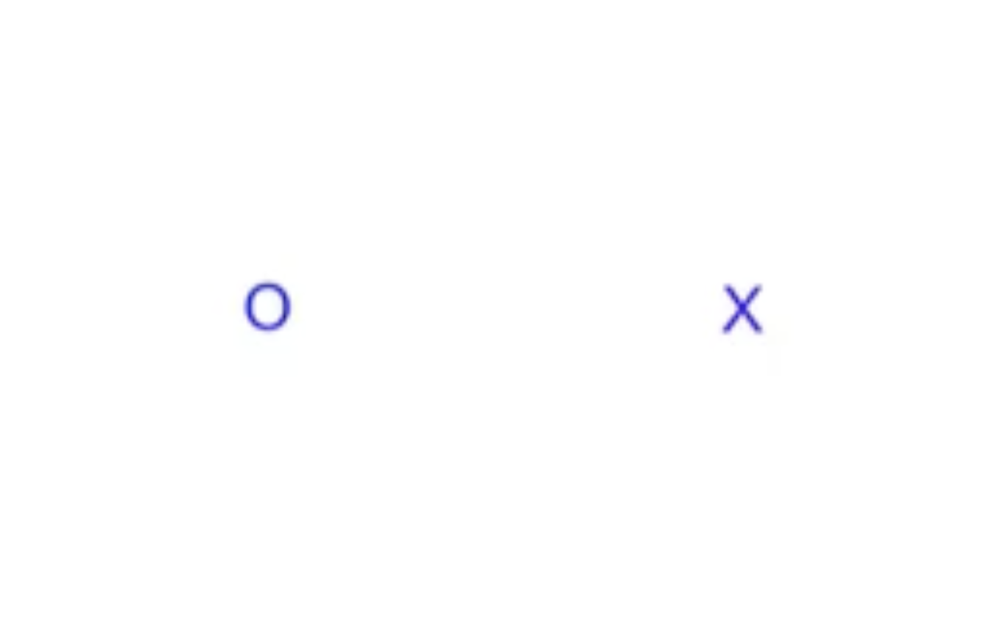
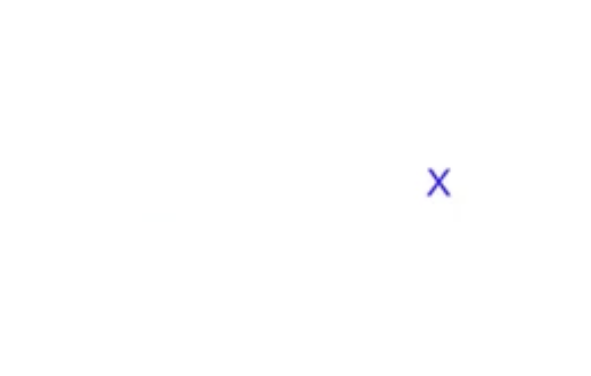
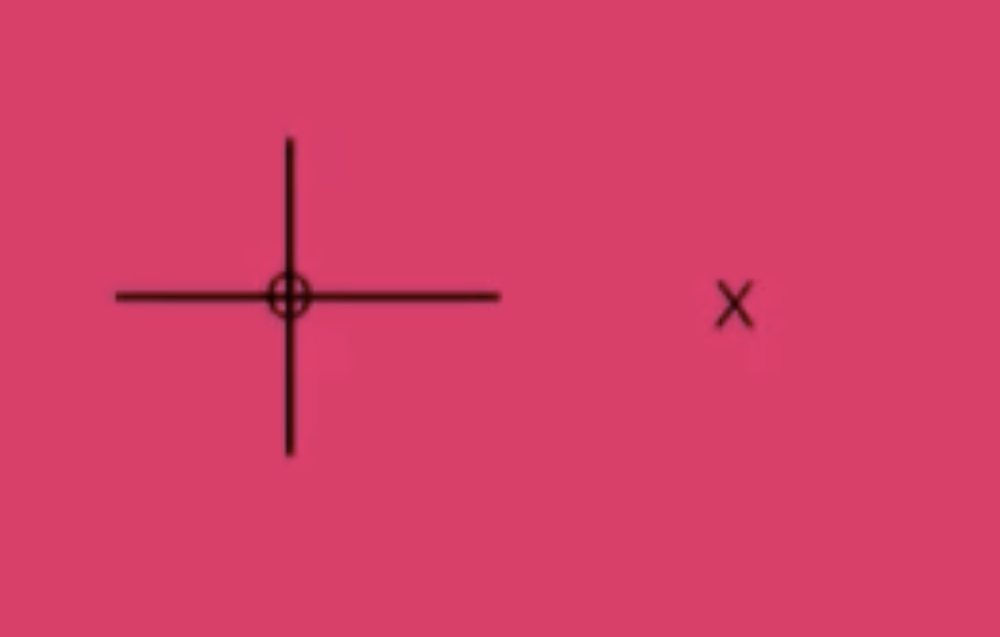
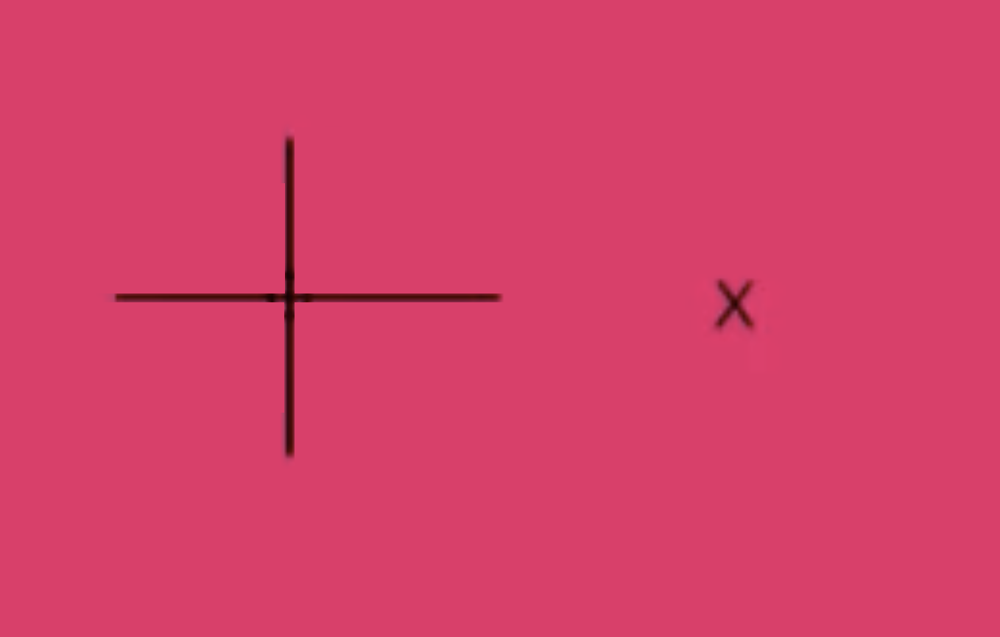
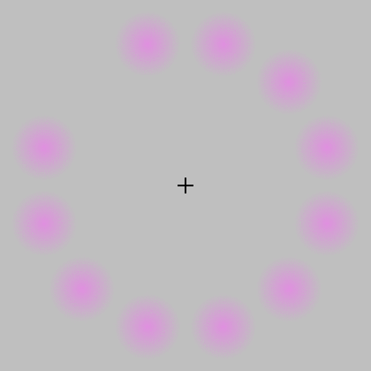
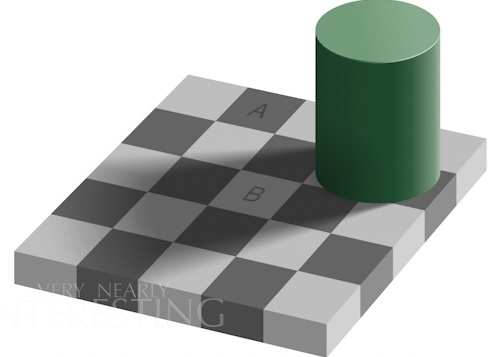
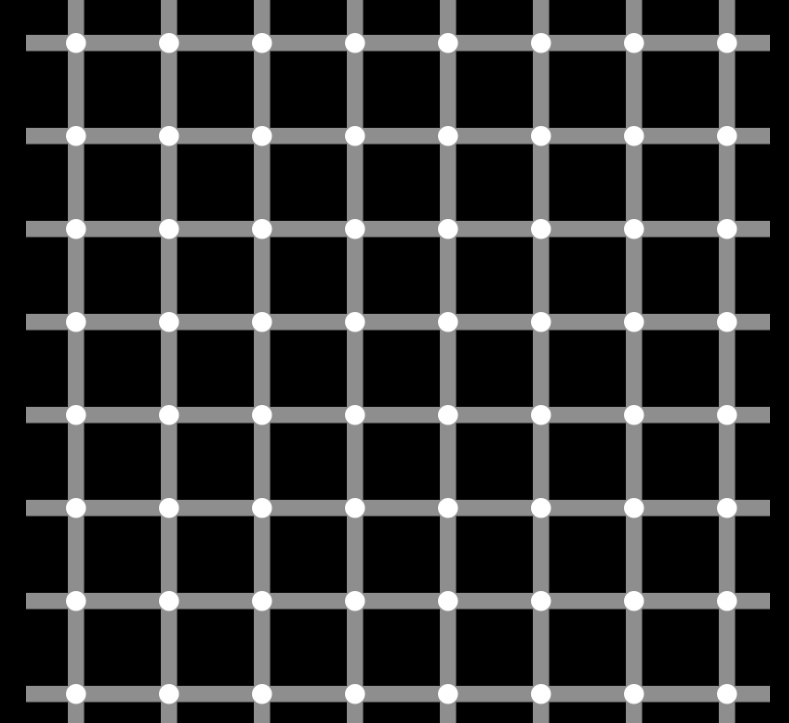
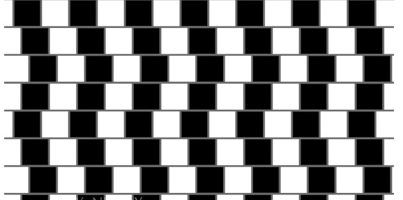
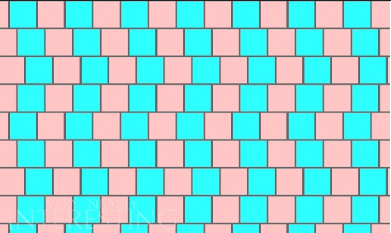
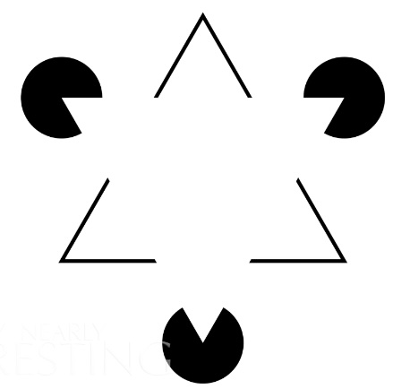

# Lab 2 - Colour and Perception

## Part 1 - Seeing Colours and Shapes

### Task 1 - Find your blind spot

| Actual Image   | Perception   | 
| :---:          | :---:        | 
| | |

When focusing on ‘X’ with right eye closed, the ‘O’ on the left side simply disappears

| Actual Image   | Perception   | 
| :---:          | :---:        | 
| | |

But with coloured background or patterns, brain completes the space. So the blind spot fills up 

**Why is this happening**

description

### Task 3 - Reverse Colour

**Why is this happening**

description

### Task 4 - Troxler’s Fading

**Observation**

1. Following the dots around: Dots simply disappears for split second
2. Focus on the + sign: Gap is being replaced with green dots (afterimage of the opposite color)
3. Focus on the + sign longer than 20 seconds: Green disc running around at the background

**Why is this happening**

Three effects are combined for the lilac chaser illusion.

1. Phi phenomenon: optical illusion of perceiving continuous motion between separate objects viewed rapidly in succession
2. Afterimage is a consequence of neural adaptation of the cells that carry signals from the retina of the eye to the rest of the brain, the retinal ganglion cells. 
    
    Green afterimage is the adaptation of the red and the blue channels.
    
3. Troxler fading: When a blurry stimulus is presented to a region of the visual field, and we keep our eyes still, that stimulus will disappear even though it is still physically presented.
    - In sensory systems, unvarying stimuli soon disappear from our awareness
    - Tactile neurons adapted and start to ignore the unimportant stimulus

### Task 5 - Brain sees what it expects

| Shadow Image   | Colour Comparison of A and B | 
| :---:          | :---:                        | 
|| |

- Blue top looks longer
- A looks darker

**Why is this happening**

### Task 6 - The Grid Illusion

**Observation**

Dark dots seem to appear and disappear rapidly at random intersections

**Why is this happening**

Lateral inhibition: Result of a group of receptors which respond to the presentation of stimuli in receptive field 

### Task 7 - Cafe Wall Illusion

Black and white image doesn't look parallel. Each line seems to have different angles to each other.

**Why is this happening**

[Irradiation illusion](https://en.wikipedia.org/wiki/Irradiation_illusion): Visual perception where a light area looks larger than of a identical black one. Happens due to the effect of enlarging the image of a light area on the retina.

So the illusion disappears when the colours are replaced with lower contrast

### Task 8 - Silhouette Illusion

Derives from the lack of visual cues for depth 

### Task 9 - Incomplete Triangles (Kanizsa’s triangle)

See two equilateral triangle

White upside down triangle appear slightly brighter than the background (stands out)

Illusory contour: Evokes the perception of an edge without a luminance or colour change across the edge