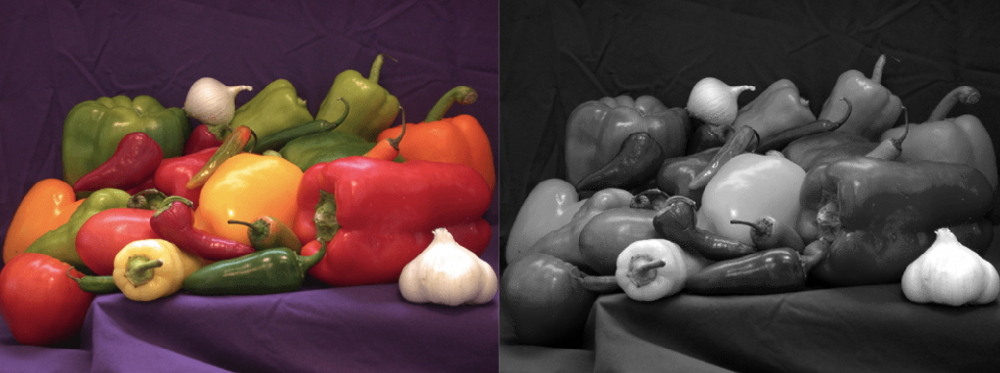
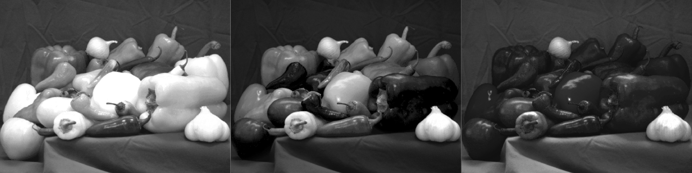
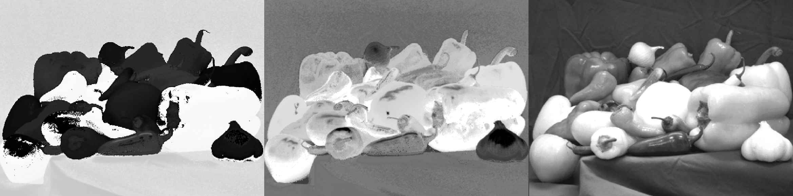
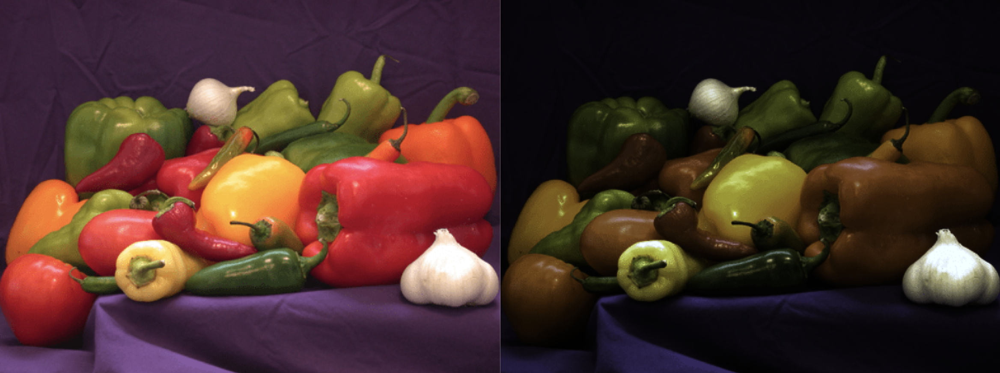

# Part 2 - Exploring Colours in MATLAB

For the full code, refer to `color.m` in the `/code` folder.

## Task 10 - Convert RGB image to grayscale



```matlab
RGB = imread('peppers.png');
I = rgb2gray(RGB);
imshowpair(RGB, I, 'montage');
```

$$
I=\begin{pmatrix}
0.299 & 0.587 & 0.114
\end{pmatrix} 
\times 
\begin{pmatrix}
R \\ G \\ B
\end{pmatrix}
$$


## Task 11 - Splitting an RGB image into separate channels



```matlab
[R,G,B] = imsplit(RGB);
montage({R, G, B},'Size',[1 3])
```

* Examine the information shown on the right side of the Matlab window. Explain their dimensions and data type of the variables RGB, R, G, B and I.


## Task 12 - Map RGB image to HSV space and into separate channels



```matlab
HSV = rgb2hsv(RGB);
[H, S, V] = imsplit(HSV);
montage({H, S, V},'Size',[1 3]);
```

**HSV** refers to Hue, Saturation, Value, which provides more user friendly colour selection compared to RGB. H, S, V in other words, are colour angle from the white colour center, amount of saturation, and luminance level, respectively.

And thus, H, S, V extracted grayscale images above represent those levels in each pixel.


## Task 13 - Map RGB image to XYZ space



```matlab
XYZ = rgb2xyz(RGB);
```

**XYZ** system works based on the psychology of human vision. As it is device-independent colour system, the colour does not depend on the specifics of the monitors or camera. 