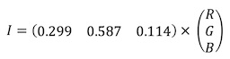

# Lab 2 - Colour and Perception

## Part 2 - Exploring Colours in MATLAB

For the full code, refer to `color.m` in the `/code` folder.

### Task 10 - Convert RGB image to grayscale


```matlab
RGB = imread('peppers.png');
I = rgb2gray(RGB);
imshowpair(RGB, I, 'montage');
```




### Task 11 - Splitting an RGB image into separate channels


```matlab
[R,G,B] = imsplit(RGB);
montage({R, G, B},'Size',[1 3])
```


### Task 12 - Map RGB image to HSV space and into separate channels


```matlab
HSV = rgb2hsv(RGB);
[H, S, V] = imsplit(HSV);
montage({H, S, V},'Size',[1 3]);
```

### Task 13 - Map RGB image to XYZ space


```matlab
XYZ = rgb2xyz(RGB);
```
