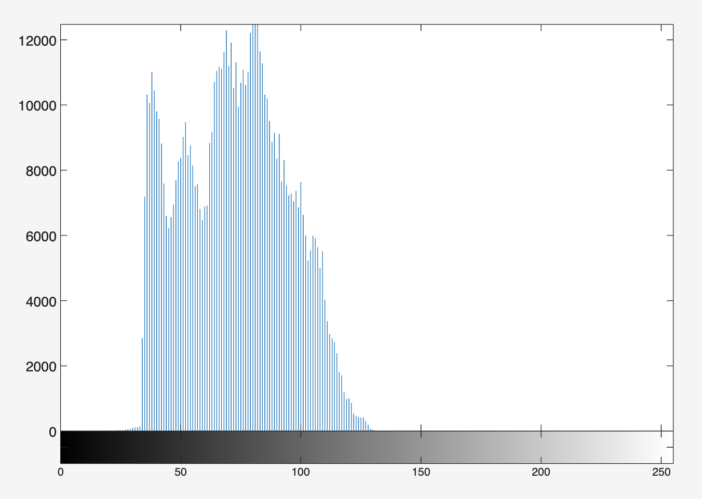
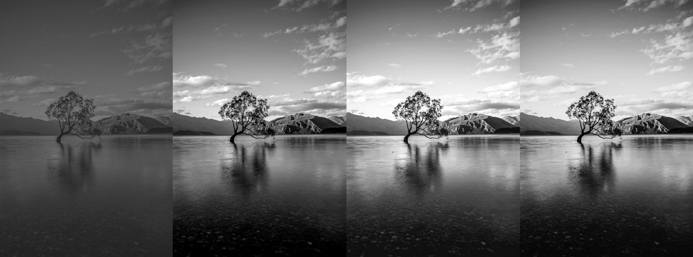
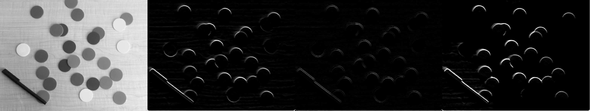
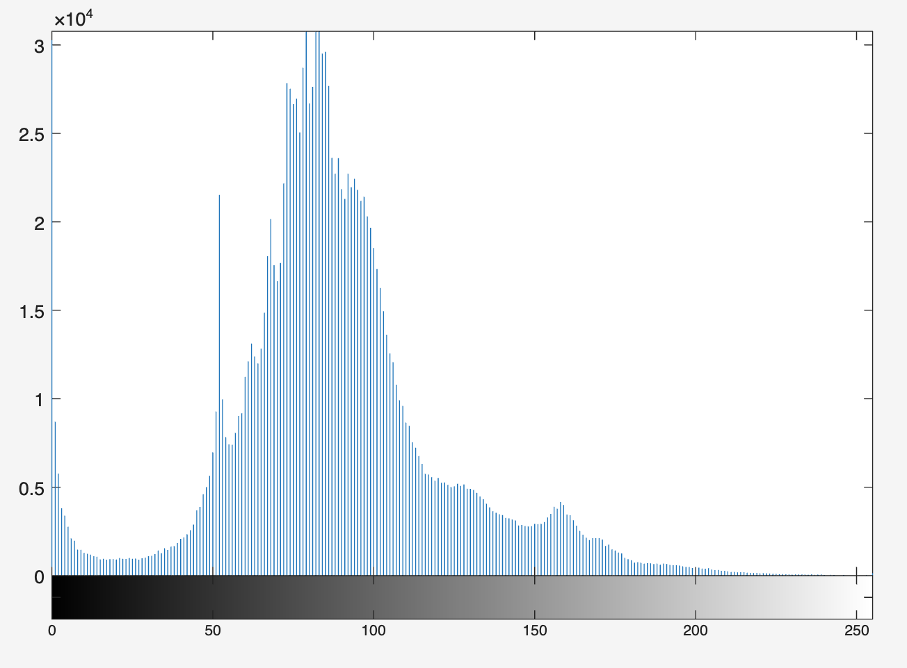
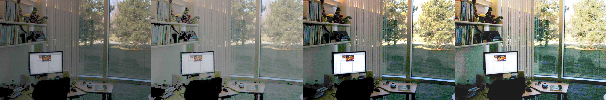

# Lab 3 - Intensity Transformation and Spatial Filtering

## Task 1 - Contrast enhancement with function imadjust
### Importing an image

```matlab
f = imread('assets/breastXray.tif');
f(3,10)             % intensity of pixel(3,10) ans = 28
imshow(f(1:285,:))  % display only top half of the image
```

Indices of 2D matrix in Matlab is of the format: (row, column). ':' is used to slice the data. The default ':' refers to the entire columns.

```
imshow(f(:,241:482))
```

The size of the image is `571x482` (from workspace), so right half will be after pixel 241.

| f(1:285,:)        | f(:,241:482)      | 
| :---:             | :---:             | 
| | |

```matlab
[fmin, fmax] = bounds(f(:))
```

`bounds` returns the maximum and minimum values in the entire image f.

The full intensity range is [0 255], and the values returned are `fmin = 21` and `fmax = 255`. It returns the value close the full range, as the image has the part ranging from light to dark. 


### Negative Image

```matlab
g1 = imadjust(f, [0 1], [1 0])
% g1 = imadjust(input, [low_in high_in], [low_out high_out])
```

As a result, 0, the lowest pixel intensity, is mapped to 1, the highest pixel intensity. Vice versa, 1 is mapped to 0. The intensities are inverted and g1 returns the inverted image.

<p align="center" width=500>  </p>


### Gamma Correction

```
g2 = imadjust(f, [0.5 0.75], [0 1]);
g3 = imadjust(f, [ ], [ ], 2);
```

<p align="center" width=500>  </p>

Left, `g2` maps the grayscale range between 0.5 and 0.75, to the full range. On the right, `g3` uses gamma correct with gamma = 2.0. 

While two generates the similar result that compresses the low end and expands the high end, `g3` retains more detail as the intensity covers the entire grayscale range.

<p align="center">  </p><BR>

Testing with different gamma values:
| gamma = 0.75      | gamma = 3         | 
| :---:             | :---:             | 
| | |

The image is further testing with different gamma values. It is obvious that lower gamma makes the image brighter, showing more details. In comparison, higher gamma expands the high intensity values while compressing the darks.

Compared to gamma correction, the linear mapping (`g2 = imadjust(f, [0.5 0.75], [0 1])`) discards all pixels below 0.5 to black, and above 0.75 to white. Gamma correction is non linear, preserving the full range of data but affecting the curvature of the mapping. 


## Task 2 - Contrast-stretching transformation

This task uses constrast stretching transformation function instead of imadjust.

<p align="center">  </p><BR>

$$s = T(r) = {1 \over 1 + (k/r)^E}$$ 

```matlab
f = imread('assets/bonescan-front.tif');
r = double(f);  % uint8 to double conversion
k = mean2(r);   % find mean intensity of image
E = 0.9;
s = 1 ./ (1.0 + (k ./ (r + eps)) .^ E);
g = uint8(255*s);
imshowpair(f, g, "montage")
```

<p align="center">  </p><BR>

* k: often set to the average intensity level 
* E: steepness of the function

With higher E, the slope gets steeper, acting more like a binary threshold. The application of contrast stretching function amplified the bright section as shown in the image. 

## Task 3 - Contrast Enhancement using Histogram
### Plotting the histogram of an image

The histogram of `pollen.tif` shows that the intensity of the image is very squashed up between 70 to 140. To spread out the intensity, the intensity between 0.3 and 0.55 can be mapped to full range using imadjust. 

```matlab
f=imread('assets/pollen.tif');
g=imadjust(f,[0.3 0.55]);
montage({f, g})
```

<p align="center">  </p><BR>

| Histogram of f       | Histogram of g      | 
| :---:             | :---:             | 
| | |

The side by side comparison of histograms clearly highlight how the image after `imadjust` has more spread out intensity over the full range.


### Histogram, PDF and CDF

```matlab
g_pdf = imhist(g) ./ numel(g);  % compute PDF
g_cdf = cumsum(g_pdf);          % compute CDF
```

| PDF           | CDF           | 
| :---:         | :---:         | 
| | |

### Histogram Equalization

```matlab
h = histeq(g,256);
% histogram equalize g
```

<p align="center">  </p><BR>

From the top, left to right, is the image of `f`, imadjusted `g`, histogram equalised `h`. The last image after histogram equalisation shows how the bright and dark areas are further reinforced.

<p align="center">  </p><BR>

And the figure above shows the histogram of those three images. 


## Task 4 - Noise reduction with lowpass filter

Produce a 9x9 averaging filter kernel and a 7x7 Gaussian kernel using `fspecial`:

```matlab
w_box = fspecial('average', [9 9])
w_gauss = fspecial('Gaussian', [7 7], 0.5)

g_box = imfilter(f, w_box, 0);
g_gauss = imfilter(f, w_gauss, 0);
```
<table width="100%">
  <thead>
    <tr>
      <th width="33%">Original</th>
      <th width="34%">Box filter</th>
      <th width="33%">Gaussian filter</th>
    </tr>
  </thead>
  <tbody>
    <tr>
      <td colspan="3" align="center">
        
      </td>
    </tr>
  </tbody>
</table>

**Exploration of various kernel size and sigma values**

* A larger kernel size creates a wider area for every pixel, ending up in stronger smoothing and more effective noise removal. However, it has risk of blurring details and edges.
* Sigma value determines the spread of the bell curve. Small sigma behaves like a smaller kernel, focused on the centre, while larger sigma causes more blurring like a standard averaging filter.


## Task 5 - Median Filtering

```matlab
g_median = medfilt2(f, [7 7], 'zero');
% medfilt2(I, [m n], padopt) 
```

<p align="center">  </p><BR>

Applying the median filtering successfully removed the noises. At the same time, the edges of shapes in the PCBs are blurred: Observable at small dots and lines.

## Task 6 - Sharpening the image with Laplacian, Sobel and Unsharp filters

<table width="100%">
  <thead>
    <tr>
      <th width="25%">Original</th>
      <th width="25%">Laplacian</th>
      <th width="25%">Sobel</th>
      <th width="25%">Unsharp</th>
    </tr>
  </thead>
  <tbody>
    <tr>
      <td colspan="4" align="center">
        
      </td>
    </tr>
  </tbody>
</table>

* **Laplacian image** creates detection of outer edge of the moon: only teh rapid changes in intensity. The line looks very thin, like a sketch of the fine detail.
* **Sobel image** has a mostly black image with bright white lines - more clearer than Laplacian - outling the edges and the craters.
* **Unsharp filter** sharpens the image, making the details more clearer. While preserving the intensity of original image, the edges of the craters are more criper. 

In the purpose for observing the better crater, sobel and unsharp filter generated the best image.


## Task 7 - Test yourself Challenges
### Improve the contrast of a lake and tree image

<p align="center">  </p><BR>

To map the image using `imadjust`, printed the histogram `imhist(f)` and mapped the range to amplify the focused region. 

```matlab
f = imread('assets/lake&tree.png');
g1 = imadjust(f, [0.15 0.5], [0 1]);
h = histeq(g1,256);
```

The contrast improvement is also attempted with contrast stretching function. To deal with low contrast image, high `E` steepness value is applied.

```matlab
r = double(f);  % uint8 to double conversion
k = mean2(r);   % find mean intensity of image
E = 5;
s = 1 ./ (1.0 + (k ./ (r + eps)) .^ E);
g2 = uint8(255*s);
```

**Results:**

<table width="100%">
  <thead>
    <tr>
      <th width="25%">Original (f)</th>
      <th width="25%">Contrast adjust (g1)</th>
      <th width="25%">Histogram equalised (h)</th>
      <th width="25%">Contrast-stretching (E=5) </th>
    </tr>
  </thead>
  <tbody>
    <tr>
      <td colspan="4" align="center">
        
      </td>
    </tr>
  </tbody>
</table>


### Find the edge of the circles in the circles image

Initially just applying the sobel filter directly, ended up also intensifying the wooden pattern of the table. Thus, to remove the noise that stands out, medfilt2 and gaussian filters are tested.

```matlab
g_med1 = medfilt2(f, [7 7], 'zero');
g1 = imfilter(g_med1, w_sobel, 0);
g2 = imfilter(g1, w_lap, 0);

h1 = imadjust(f, [0.1 0.65], [0 1]);
g_med2 = medfilt2(h1, [7 7], 'zero');
g3 = imfilter(g_med2, w_sobel, 0);
```

<table width="100%">
  <thead>
    <tr>
      <th width="25%">Original (f)</th>
      <th width="25%">Median + Sobel (g1)</th>
      <th width="25%">g1 + Laplacian (g2)</th>
      <th width="25%">Contrast + Median + Sobel (g3)</th>
    </tr>
  </thead>
  <tbody>
    <tr>
      <td colspan="4" align="center">
        
      </td>
    </tr>
  </tbody>
</table>


### Improve the lighting and colour of the office photo

<p align="center">  </p><BR>

Similar approach as to lake image is implemented. Similarly, the image is focused at the low range of intensity, but more spreaded out.

```matlab
g1 = imadjust(f, [], [], 0.6);
g2 = imadjust(f, [0.15 0.6], [0 1]);
h = histeq(g2,256);
```

`g1` used gamme correction, where `g2` directly mapped the range. The comparison of image figures, showed better improvement in `g2` case. To further improve the bright area, histogram equalisation is then applied.  

<table width="100%">
  <thead>
    <tr>
      <th width="25%">Original (f)</th>
      <th width="25%">Gamma correction (g1)</th>
      <th width="25%">Contrast adjust(g2)</th>
      <th width="25%">Histogram equalised(h)</th>
    </tr>
  </thead>
  <tbody>
    <tr>
      <td colspan="4" align="center">
        
      </td>
    </tr>
  </tbody>
</table>
