# Lab 4 - Morphological Image Processing

## Task 1 - Dilation and Erosion
### Dilation Operation

Three distinct structuring element (SE) is applied to original image `text-broken.tif` with dilation operation.

```matlab
A = imread('assets/text-broken.tif');

% Disk
B1 = [0 1 0;
      1 1 1;
      0 1 0];
     
% All 1's
B2 = ones(3,3); 

% Diagonal cross
Bx = [1 0 1;
      0 1 0;
      1 0 1];
      
% Dilate function
A1 = imdilate (A, B1);
A2 = imdilate (A, B2);
Ax = imdilate (A, Bx);
```

<table width="100%">
  <thead>
    <tr>
      <th width="25%">Original</th>
      <th width="25%">A1</th>
      <th width="25%">A2</th>
      <th width="25%">Ax</th>
    </tr>
  </thead>
  <tbody>
    <tr>
      <td colspan="4" align="center">
        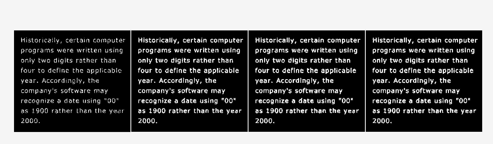
      </td>
    </tr>
  </tbody>
</table>

Then, the original image is dilated with B1 multiple times.

```matlab
A11 = imdilate(A1, B1);
A111 = imdilate(A11, B1);
```

<table width="100%">
  <thead>
    <tr>
      <th width="25%">Original</th>
      <th width="25%">Once</th>
      <th width="25%">Twice</th>
      <th width="25%">Triple</th>
    </tr>
  </thead>
  <tbody>
    <tr>
      <td colspan="4" align="center">
        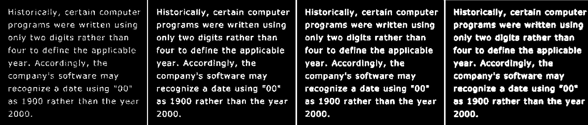
      </td>
    </tr>
  </tbody>
</table>

What happens?


### Structuring Element

```matlab
SE = strel('disk', 4);
SE.Neighborhood
```

A disk with radius of 4 is created:

<p align="center" width="200px"> 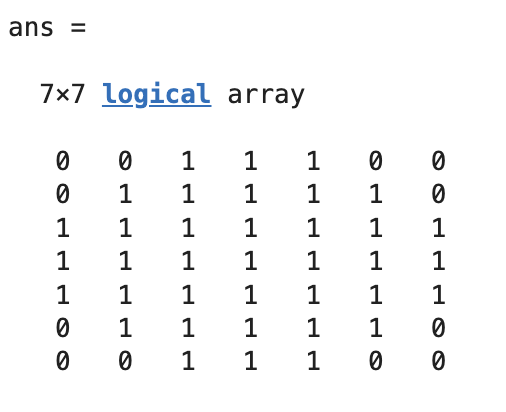 </p>


### Erosion Operation

```matlab
A = imread('assets/wirebond-mask.tif');

SE2 = strel('disk',2);
SE10 = strel('disk',10);
SE20 = strel('disk',20);

% Erode function 
E2 = imerode(A,SE2);
E10 = imerode(A,SE10);
E20 = imerode(A,SE20);
```

<table width="100%">
  <thead>
    <tr>
      <th width="25%">Original</th>
      <th width="25%">E2</th>
      <th width="25%">E10</th>
      <th width="25%">E20</th>
    </tr>
  </thead>
  <tbody>
    <tr>
      <td colspan="4" align="center">
        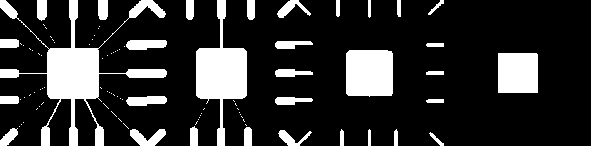
      </td>
    </tr>
  </tbody>
</table>

**Comment on the results**


## Task 2 - Morphological Filtering with Open and Close
### Opening = Erosion + Dilation

```matlab
f = imread('assets/fingerprint-noisy.tif');

% 3x3 structuring element
SE = strel('disk', 1); 

fe = imerode(f, SE);
fed = imdilate(fe, SE);
fo = imopen(f, SE);
```

<table width="100%">
  <thead>
    <tr>
      <th width="25%">f</th>
      <th width="25%">fe</th>
      <th width="25%">fed</th>
      <th width="25%">fo</th>
    </tr>
  </thead>
    <tbody>
    <tr>
      <td colspan="4" align="center">
        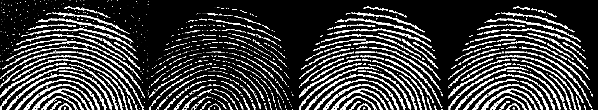
        <p align="center"> ▲ 3x3 disk SE </p>
      </td>
    </tr>
    <tr>
      <td colspan="4" align="center">
        
        <p align="center"> ▲ 4x4 disk SE </p>
      </td>
    </tr>
    <tr>
      <td colspan="4" align="center">
        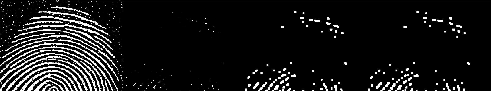
        <p align="center"> ▲ 5x5 disk SE </p>
      </td>
    </tr>
    <tr>
      <td colspan="4" align="center">
        3
        <p align="center"> ▲ 3x3 diamond SE </p>
      </td>
    </tr>
    <tr>
      <td colspan="4" align="center">
        
        <p align="center"> ▲ 3x3 ones SE </p>
      </td>
    </tr>
  </tbody>
</table>


what happens with other size and shape of structuring element.

**Improve the image fo with a close operation**


### Comparison to Spatial Filter

Comment on the comparison.


## Task 3 - Boundary Detection

<table width="100%">
  <thead>
    <tr>
      <th width="25%">I</th>
      <th width="25%">BW</th>
      <th width="25%">Erosed BW</th>
      <th width="25%">Boundary detected</th>
    </tr>
  </thead>
  <tbody>
    <tr>
      <td colspan="4" align="center">
        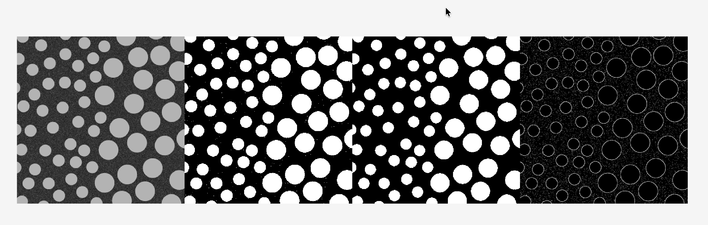
      </td>
    </tr>
  </tbody>
</table>

Comment on the result.
How can you improve on this result

## Task 4 - Thinning and Thicknening

### Function bwmorph
```matlab
g = bwmorph(f, operations, n)
```
* _f_: input binary image
* _operations_: string for specific operation
* _n_: positive integer, number of times the operation should be repeated (default n = 1)

```matlab
% Initial processing into binary image 
f = imread('assets/fingerprint.tif');
f = imcomplement(f);
level = graythresh(f);
BW = imbinarize(f, level);

% Used cell to perform thinning operation numtiple times 
g = cell(1, 5);
for k = 1:5
    g{k} = bwmorph(BW, 'thin', k);
end

% n = inf. 
ginf = bwmorph(BW, 'thin', inf);

montage({BW, g{1}, g{2}, g{3}}, 'Size', [1 4]);
figure;
montage({g{1}, g{3}, g{5}, ginf}, 'Size', [1 4]);
```

<table width="100%">
  <thead>
    <tr>
      <th width="25%">BW</th>
      <th width="25%">g1</th>
      <th width="25%">g2</th>
      <th width="25%">g3</th>
    </tr>
  </thead>
  <tbody>
    <tr>
      <td colspan="4" align="center">
        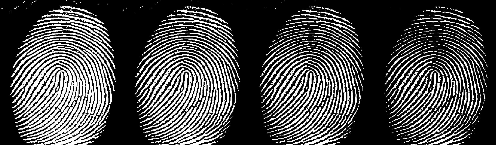
      </td>
    </tr>
  </tbody>
</table>

<table width="100%">
  <thead>
    <tr>
      <th width="25%">g1</th>
      <th width="25%">g3</th>
      <th width="25%">g5</th>
      <th width="25%">ginf</th>
    </tr>
  </thead>
  <tbody>
    <tr>
      <td colspan="4" align="center">
        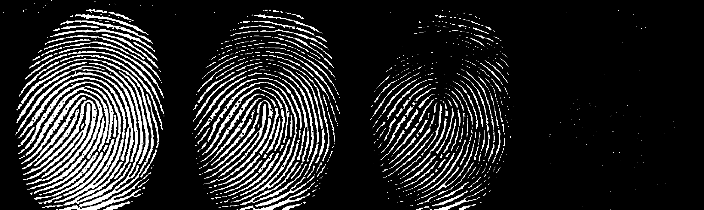
      </td>
    </tr>
  </tbody>
</table>

```matlab
gthin = bwmorph(BW, 'thin', 12);
gthin = imcomplement(gthin);
```

<p align="center" width="200px"> 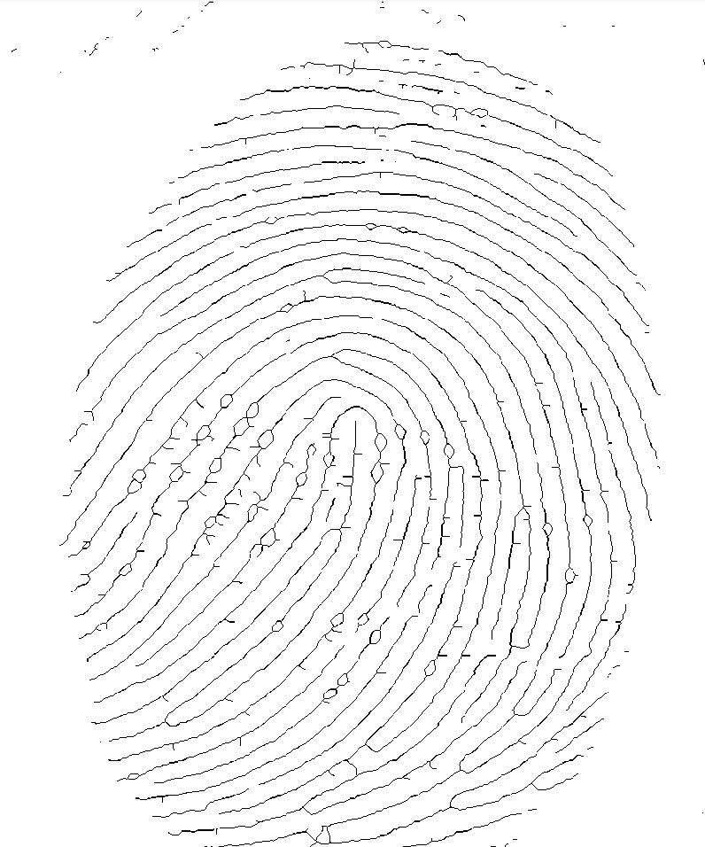 </p>

n=12 found after the iteration: where the result shown close to lines. imcomplement applied to reverse the color back after the thinning operation


## Task 5 - Connected Components and Labels

| Original      | Connected Removed | 
| :---:         | :---:             | 
|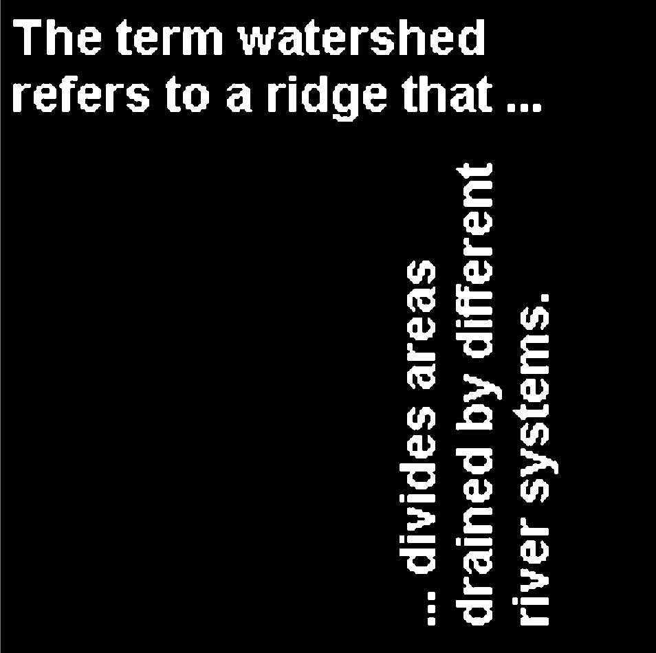 | 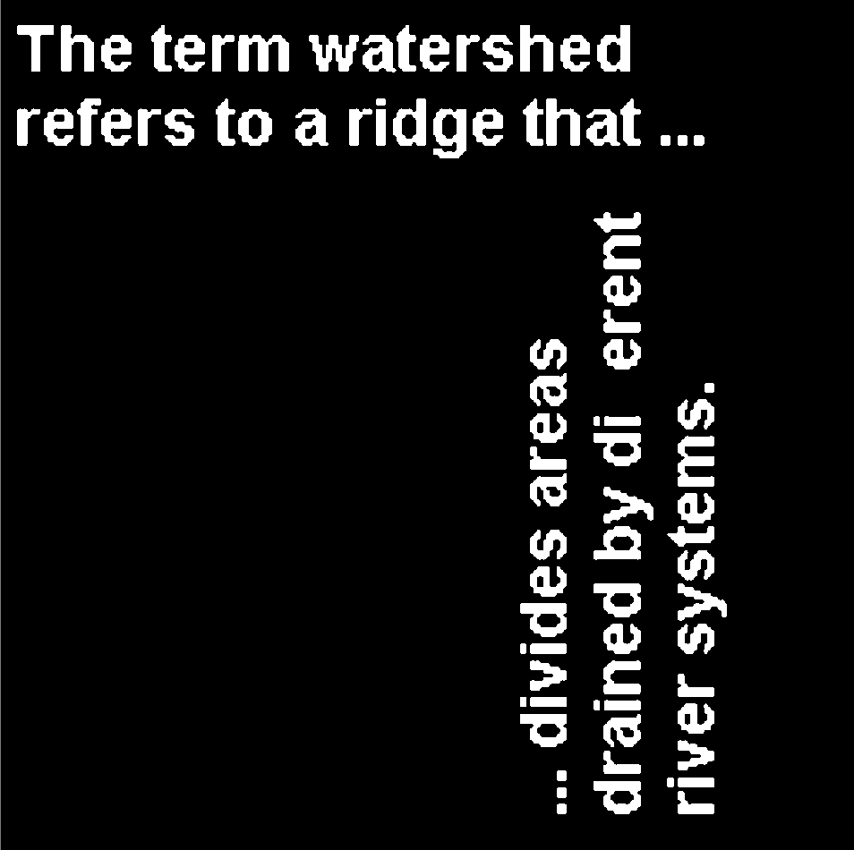|

```matlab
CC = bwconncomp(t)
```

## Task 6 - Morphological Reconstruction
### Keeping long and thin letters

```matlab
f = imread('assets/text_bw.tif');
se = ones(17,1);
g = imerode(f, se);
fo = imopen(f, se);
fr = imreconstruct(g, f);
```

<table width="100%">
  <thead>
    <tr>
      <th width="25%">f</th>
      <th width="25%">g</th>
      <th width="25%">fo</th>
      <th width="25%">fr</th>
    </tr>
  </thead>
  <tbody>
    <tr>
      <td colspan="4" align="center">
        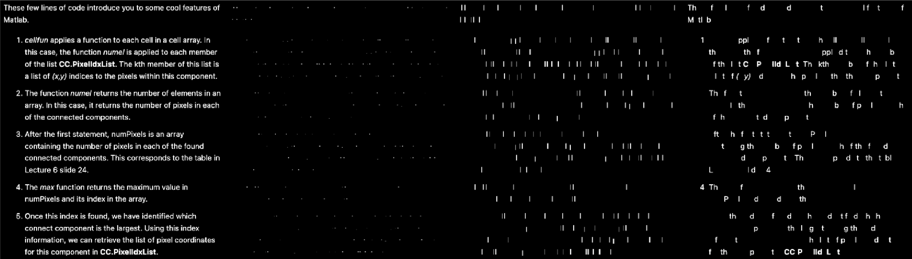
      </td>
    </tr>
  </tbody>
</table>


### Fill the holes in an image

```matlab
ff = imfill(f);
```

<p align="center"> 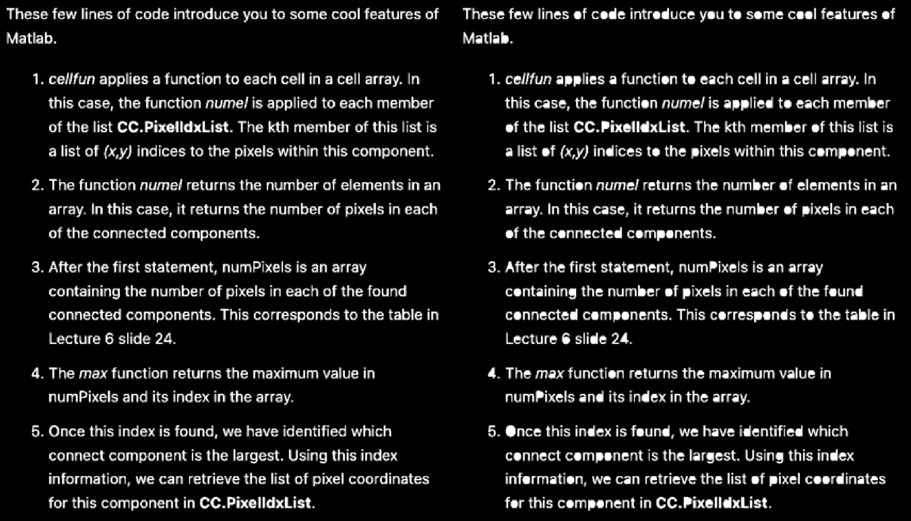 </p>


## Task 7 - Morphological Operations on Grayscale Images

<table width="100%">
  <thead>
    <tr>
      <th width="25%">f</th>
      <th width="25%">gd</th>
      <th width="25%">ge</th>
      <th width="25%">gg</th>
    </tr>
  </thead>
  <tbody>
    <tr>
      <td colspan="4" align="center">
        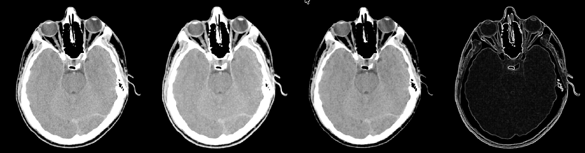
      </td>
    </tr>
  </tbody>
</table>


## Challenge
### Finding the number of fillings and their sizes

**Instruction**: The grayscale image file 'assets/fillings.tif' is a dental X-ray corrupted by noise. Find how many fills this patient has and their sizes in number of pixels.

Approach: Reconstruct the image to reduce the noise
Binarise the image so that the fillings are identified
Use `CC = bwconncomp(t)` to find the connected filling area 
and refer to datas structure for NumObjects and PixelIdxList

```matlab
f = imread('assets/fillings.tif');
fc = imcomplement(f);

SE = strel('disk', 2);
g = imerode(fc, SE);
fr = imreconstruct(g, fc);
fr = imcomplement(fr);

imhist(fr);
```

<p align="center"> 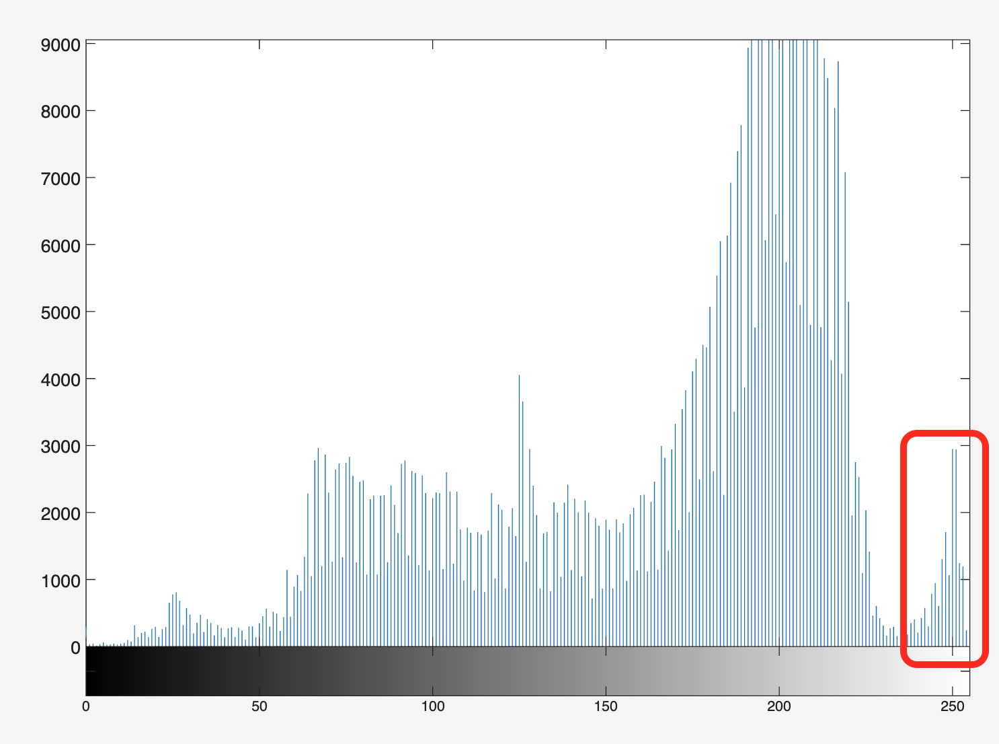 </p>

```matlab
level = 0.9;
BW = imbinarize(fr, level);
```

<table width="100%">
  <thead>
    <tr>
      <th width="33%">Original</th>
      <th width="34%">Reconstructed</th>
      <th width="33%">BW</th>
    </tr>
  </thead>
  <tbody>
    <tr>
      <td colspan="3" align="center">
        
      </td>
    </tr>
  </tbody>
</table>

```matlab
CC = bwconncomp(BW);
FN = CC.NumObjects; % number of fillings
FS = cellfun(@numel, CC.PixelIdxList); % size of each filling
```

<p align="center"> 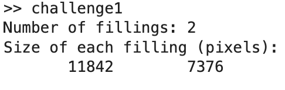 </p>
