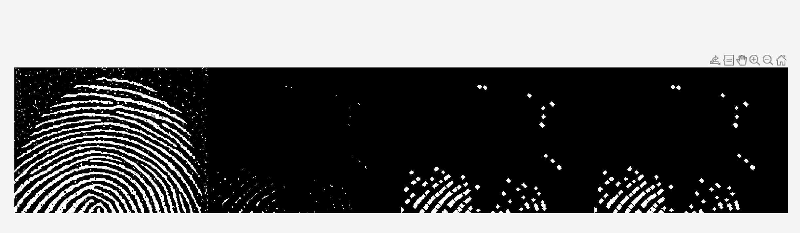
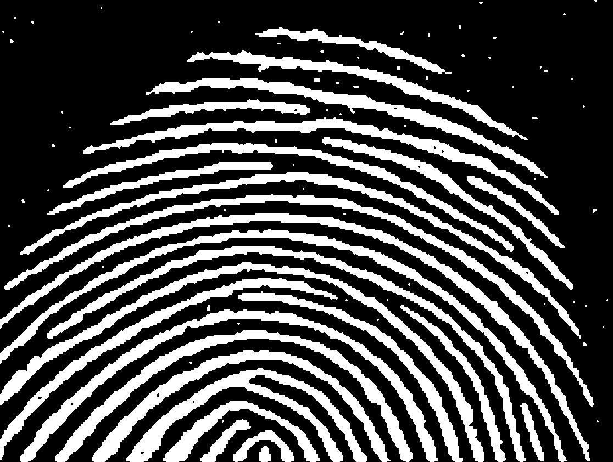
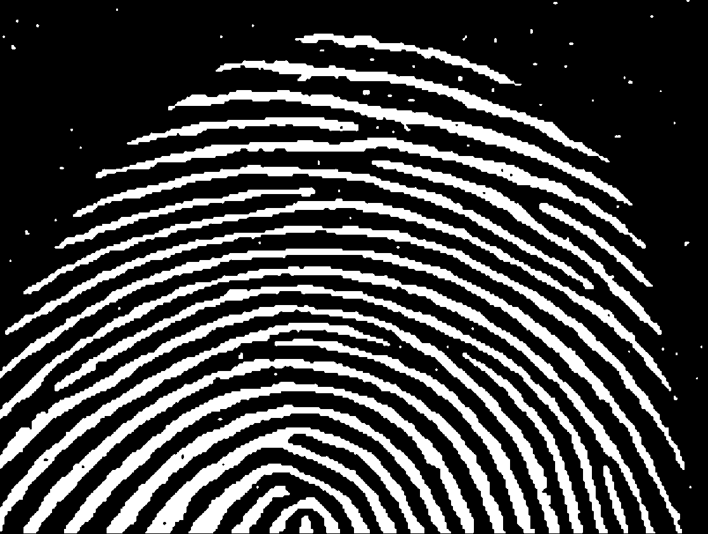
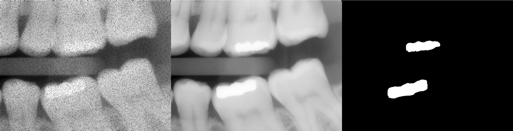

# Lab 4 - Morphological Image Processing

## Task 1 - Dilation and Erosion
### Dilation Operation

Three distinct structuring element (SE) is applied to original image `text-broken.tif` with dilation operation.

```matlab
A = imread('assets/text-broken.tif');

% Disk
B1 = [0 1 0;
      1 1 1;
      0 1 0];
     
% All 1's
B2 = ones(3,3); 

% Diagonal cross
Bx = [1 0 1;
      0 1 0;
      1 0 1];
      
% Dilate function
A1 = imdilate (A, B1);
A2 = imdilate (A, B2);
Ax = imdilate (A, Bx);
```

<table width="100%">
  <thead>
    <tr>
      <th width="25%">Original</th>
      <th width="25%">A1 (3x3 disk)</th>
      <th width="25%">A2 (3x3 ones)</th>
      <th width="25%">Ax (3x3 diagonal cross)</th>
    </tr>
  </thead>
  <tbody>
    <tr>
      <td colspan="4" align="center">
        
      </td>
    </tr>
  </tbody>
</table>

Then, the original image is dilated with B1 multiple times.

```matlab
A11 = imdilate(A1, B1);
A111 = imdilate(A11, B1);
```

<table width="100%">
  <thead>
    <tr>
      <th width="25%">Original</th>
      <th width="25%">Once</th>
      <th width="25%">Twice</th>
      <th width="25%">Triple</th>
    </tr>
  </thead>
  <tbody>
    <tr>
      <td colspan="4" align="center">
        
      </td>
    </tr>
  </tbody>
</table>

Repeated dilation cumulates the effect of growing the white regions. As a result, one dilation effectively recovers the broken text, but multiple iterations end up objects to touch and merge into larger blocks.


### Structuring Element

```matlab
SE = strel('disk', 4);
SE.Neighborhood
```

A disk with radius of 4 is created:

<p align="center">  </p>


### Erosion Operation

```matlab
A = imread('assets/wirebond-mask.tif');

SE2 = strel('disk',2);
SE10 = strel('disk',10);
SE20 = strel('disk',20);

% Erode function 
E2 = imerode(A,SE2);
E10 = imerode(A,SE10);
E20 = imerode(A,SE20);
```

<table width="100%">
  <thead>
    <tr>
      <th width="25%">Original</th>
      <th width="25%">E2</th>
      <th width="25%">E10</th>
      <th width="25%">E20</th>
    </tr>
  </thead>
  <tbody>
    <tr>
      <td colspan="4" align="center">
        
      </td>
    </tr>
  </tbody>
</table>

As the size of the sturcturing element grow, only largest and thickest core of the objects remain. Progressively from left to right, it is observable how thin lines is vanished first, then the moderate thickness lines at the edges.

With the largest `SE20` structuring element, only bulky block in the centre is left, but also with reduced size as a result of erosion.


## Task 2 - Morphological Filtering with Open and Close
### Opening = Erosion + Dilation

```matlab
f = imread('assets/fingerprint-noisy.tif');

% 3x3 structuring element
SE = strel('disk', 1); 

fe = imerode(f, SE);
fed = imdilate(fe, SE);
fo = imopen(f, SE);
```

<table width="100%">
  <thead>
    <tr>
      <th width="25%">f</th>
      <th width="25%">fe</th>
      <th width="25%">fed</th>
      <th width="25%">fo</th>
    </tr>
  </thead>
    <tbody>
    <tr>
      <td colspan="4" align="center">
        
        <p align="center"> ▲ 3x3 disk SE </p>
      </td>
    </tr>
    <tr>
      <td colspan="4" align="center">
        
        <p align="center"> ▲ 4x4 disk SE </p>
      </td>
    </tr>
    <tr>
      <td colspan="4" align="center">
        
        <p align="center"> ▲ 5x5 disk SE </p>
      </td>
    </tr>
    <tr>
      <td colspan="4" align="center">
        3
        <p align="center"> ▲ 3x3 diamond SE </p>
      </td>
    </tr>
    <tr>
      <td colspan="4" align="center">
        
        <p align="center"> ▲ 3x3 ones SE </p>
      </td>
    </tr>
  </tbody>
</table>

1. Size difference for same shape (Disk, 3x3 to 5x5)

A larger size removes larger noise particles - ended up erasing the part of finger prints. 

2. Different shapes for same size (Disk. Diamond, Ones)

Disk seems to preserve the form the best. Similarly with diamond. Ones preserves the most elements but in `fed` images (third column), it is seen that some round edge details are lost compared to disk.


### Comparison to Spatial Filter

| Gaussian [2 2]   | Gaussian [4 4]   | Gaussian [8 8] |
| :---:          | :---:        |:---:        |
| | | |

Applying Gaussian filter generates more smooth, gradual result. However, it fails to remove all noises as the filter rather spreads the brightness out, diluting it. It is compared to how morphological filter removes the element smaller than SE completely, successful in reducing noises.


## Task 3 - Boundary Detection

```matlab
I = imcomplement(I);
level = graythresh(I);
BW = imbinarize(I, level);
```

`graythresh` computes the global threshold level from the grayscale image to divide black and white pixels. 

```matlab
SE = ones(3,3);
E = imerode(BW, SE);
BD = BW - E;
```

Then the boundary is detected by subtracting the eroded image from BW:

<table width="100%">
  <thead>
    <tr>
      <th width="25%">I</th>
      <th width="25%">BW</th>
      <th width="25%">Erosed BW</th>
      <th width="25%">Boundary detected</th>
    </tr>
  </thead>
  <tbody>
    <tr>
      <td colspan="4" align="center">
        
      </td>
    </tr>
  </tbody>
</table>

While the boundary of the bubbles are clearly captured, the small noises around the bubbles are also captured. 

 To improve further on the result, filtering can be applied before the `BW` operation to remove the small grains that are not main.


## Task 4 - Thinning and Thicknening

### Function bwmorph
```matlab
g = bwmorph(f, operations, n)
```
* _f_: input binary image
* _operations_: string for specific operation
* _n_: positive integer, number of times the operation should be repeated (default n = 1)

```matlab
% Initial processing into binary image 
f = imread('assets/fingerprint.tif');
f = imcomplement(f);
level = graythresh(f);
BW = imbinarize(f, level);

% Used cell to perform thinning operation numtiple times 
g = cell(1, 5);
for k = 1:5
    g{k} = bwmorph(BW, 'thin', k);
end

% n = inf. 
ginf = bwmorph(BW, 'thin', inf);

montage({BW, g{1}, g{2}, g{3}}, 'Size', [1 4]);
figure;
montage({g{1}, g{3}, g{5}, ginf}, 'Size', [1 4]);
```

<table width="100%">
  <thead>
    <tr>
      <th width="25%">BW</th>
      <th width="25%">g1</th>
      <th width="25%">g2</th>
      <th width="25%">g3</th>
    </tr>
  </thead>
  <tbody>
    <tr>
      <td colspan="4" align="center">
        
      </td>
    </tr>
  </tbody>
</table>

<table width="100%">
  <thead>
    <tr>
      <th width="25%">g1</th>
      <th width="25%">g3</th>
      <th width="25%">g5</th>
      <th width="25%">ginf</th>
    </tr>
  </thead>
  <tbody>
    <tr>
      <td colspan="4" align="center">
        
      </td>
    </tr>
  </tbody>
</table>

```matlab
gthin = bwmorph(BW, 'thin', 12);
gthin = imcomplement(gthin);
```

<p align="center">  </p>

`n = 12` found after the iteration: where the result shown close to lines. After this thinning operation, reversing (`imcomplement`) is applied to reverse the color back to black lines in white background.


## Task 5 - Connected Components and Labels

| Original      | Connected Removed | 
| :---:         | :---:             | 
| | |

```matlab
CC = bwconncomp(t)
```

CC returned by `bwconncomp`, contains the information regarding the number, size, and pixels of the connected components. 

```matlab
numPixels = cellfun(@numel, CC.PixelIdxList);
[biggest, idx] = max(numPixels);
t(CC.PixelIdxList{idx}) = 0;
```

From the array of several connected elements, the code above finds the largest connect component's index and its pixel coordinates.


## Task 6 - Morphological Reconstruction
### Keeping long and thin letters

```matlab
f = imread('assets/text_bw.tif');
se = ones(17,1);
g = imerode(f, se);
fo = imopen(f, se);
fr = imreconstruct(g, f);
```

<table width="100%">
  <thead>
    <tr>
      <th width="25%">f</th>
      <th width="25%">g</th>
      <th width="25%">fo</th>
      <th width="25%">fr</th>
    </tr>
  </thead>
  <tbody>
    <tr>
      <td colspan="4" align="center">
        
      </td>
    </tr>
  </tbody>
</table>


### Fill the holes in an image

```matlab
ff = imfill(f);
```

<p align="center">  </p>

## Task 7 - Morphological Operations on Grayscale Images

<table width="100%">
  <thead>
    <tr>
      <th width="25%">Original (f)</th>
      <th width="25%">Dilate (gd)</th>
      <th width="25%">Erode (ge)</th>
      <th width="25%">Boundary Detected(gg)</th>
    </tr>
  </thead>
  <tbody>
    <tr>
      <td colspan="4" align="center">
        
      </td>
    </tr>
  </tbody>
</table>

When applied to grayscale image, below are the observations:
* Dilated: The image looks brighter overall, and bright regions look thicker. The white bone area seems expanded.
* Eroded: The image looks darker and thinner. The dark area, noticeable in top centre area, is expanded.
* Result: Clear outline is created. Bright and thicker line for outer region, and thinner for inner region.


## Challenge
### Finding the number of fillings and their sizes

**Instruction**: The grayscale image file 'assets/fillings.tif' is a dental X-ray corrupted by noise. Find how many fills this patient has and their sizes in number of pixels.

**Approach**: 

First, polished the image so that the image is clean without noises.

Chose reconstruction to reduce the noise. 
```matlab
f = imread('assets/fillings.tif');
fc = imcomplement(f);

SE = strel('disk', 2);
g = imerode(fc, SE);
fr = imreconstruct(g, fc);
fr = imcomplement(fr);
```

Using `graythresh` in this context did not separated the fillings correctly. Thus, by printing out the histogram, the manual level of `0.9` is identified and used for binarising the image.

<p align="center">  </p>

```matlab
imhist(fr);
level = 0.9;
BW = imbinarize(fr, level);
```

<table width="100%">
  <thead>
    <tr>
      <th width="33%">Original</th>
      <th width="34%">Reconstructed</th>
      <th width="33%">BW</th>
    </tr>
  </thead>
  <tbody>
    <tr>
      <td colspan="3" align="center">
        
      </td>
    </tr>
  </tbody>
</table>

Lastly, `CC = bwconncomp(t)` is used to store the data structure for connected filling areas. From this, NumObjects and PixelIdxList are referred to find the number of fillings and size of each.

```matlab
CC = bwconncomp(BW);
FN = CC.NumObjects; % number of fillings
FS = cellfun(@numel, CC.PixelIdxList); % size of each filling
```

<p align="center">  </p>
